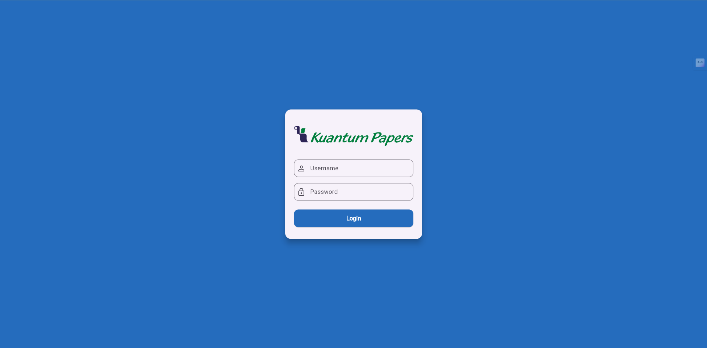
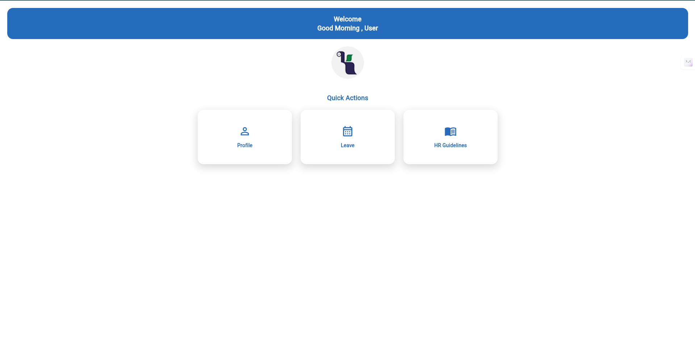
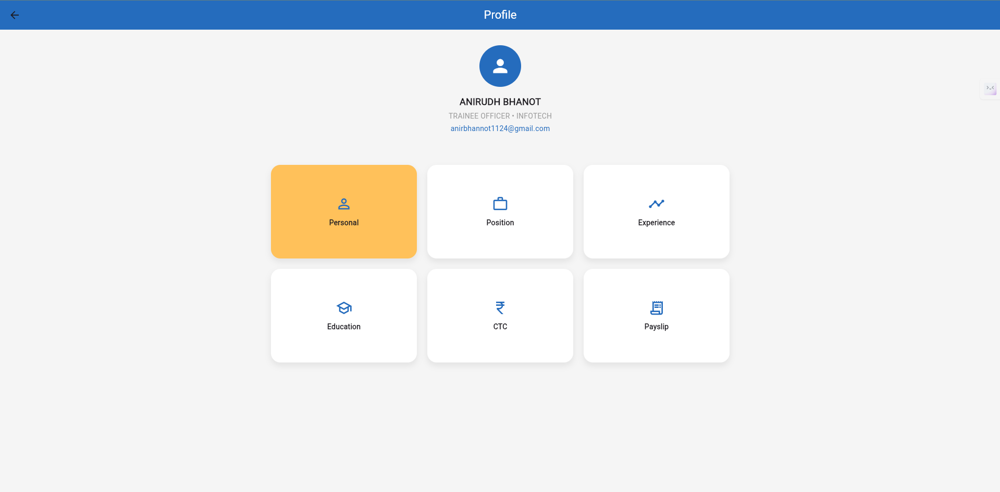
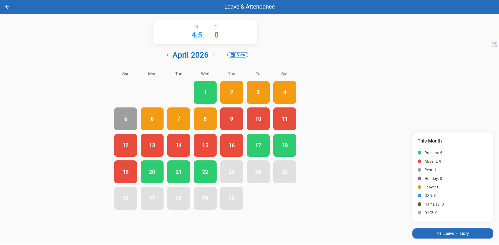
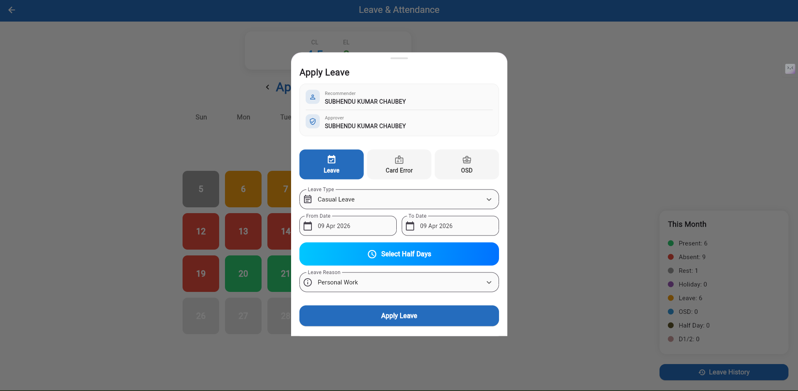

# HRMS Application - Web & Mobile

A modern **Human Resource Management System (HRMS)** built using **Flutter, ASP.NET Core Web API, and SQL Server**.

This application is designed for internal company use and provides employees with secure access to their **profile details, leave management, attendance tracking, payslips, and HR guidelines**.

The project supports both:

- 🌐 **Web Application**
- 📱 **Mobile Application**

---

## 🚀 Features

### 🔐 Secure Login
Only **validated and authorized employees** can log in to the system.

This ensures that no external or unauthorized users can access company HR data.

Features include:
- User authentication
- Role-based access
- Secure session handling
- Protected internal access

---

## 🏠 Landing Dashboard
After successful login, users are redirected to the dashboard.

The dashboard tiles are displayed **based on the employee's company role**.

Available modules include:

- 👤 Profile
- 🗓 Leave
- 📘 HR Guidelines

---

## 👤 Profile Module
The profile section allows employees to view their personal and professional details.

Includes:

- Personal information
- Employee designation
- Experience details
- Education details
- CTC information
- Payslip access

---

## 📅 Attendance Management
Employees can track their monthly attendance.

This module provides:

- Present days
- Absent days
- Leave days
- Rest / holidays
- Attendance calendar view
- Monthly summary

---

## 📝 Leave Management
Employees can apply for leave directly from the portal.

Supported features:

- Casual leave application
- Date selection
- Half-day selection
- Leave reason selection
- Approver / recommender details
- Leave history

---

## 🛠 Tech Stack

### Frontend
- **Flutter**
- Responsive Web UI
- Mobile Application

### Backend
- **ASP.NET Core Web API**

### Database
- **SQL Server**

---

## 📷 Application Screenshots

### Login Page
Secure login page for validated employees only.

---

### Dashboard / Landing Page
Role-based quick access tiles.

---

### Profile Page
Employee personal and payroll details.

---

### Attendance Page
Monthly attendance calendar and statistics.

---

### Leave Application
Leave request management page.

---

## 💼 Use Case
This HRMS solution is built for company employees to simplify:

- Attendance monitoring
- Leave approvals
- Employee self-service
- HR policy access
- Payroll details

---

## 📌 Project Status
✅ Active Development  
🚀 Production-ready modules implemented

---

## 👨‍💻 Developed By
**Anirudh Bhanot**
